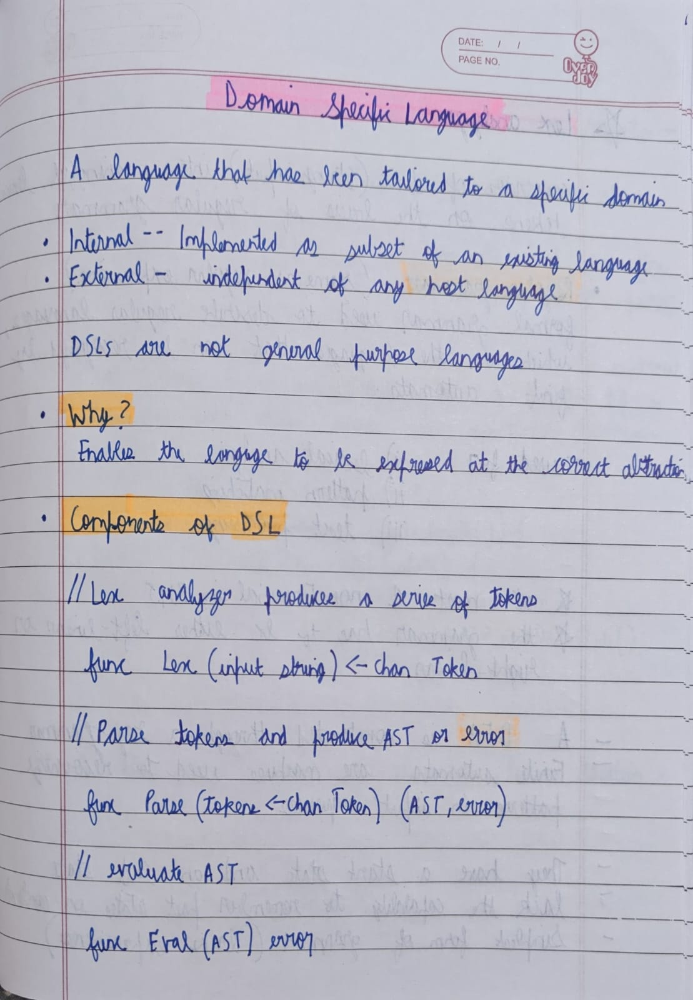
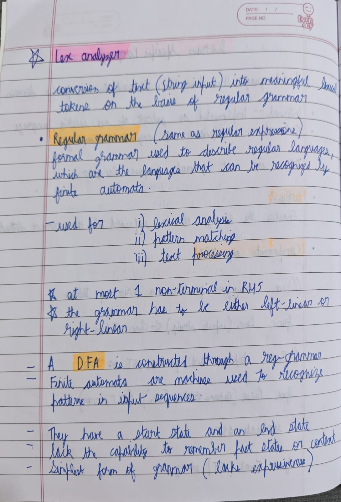
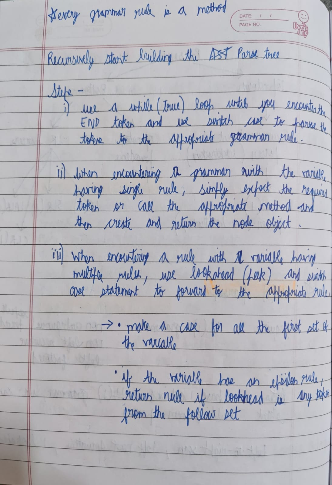

## A simple practice project in preparation for a future project
# Work Done
- Built a lex analyzer using a Deterministic finite automata implementing a regular grammar
- Built an LL(1) parser with non-ambiguous, non-left recursive and left factored grammar
- Made use of virtual threads and concurrent collections data structure (LinkedBlockingQueue) to run the lexer and parser parallely
- Implemented visitor pattern to traverse the AST generated by the LL(1) parser

# Notes made for the project

